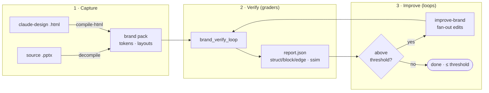
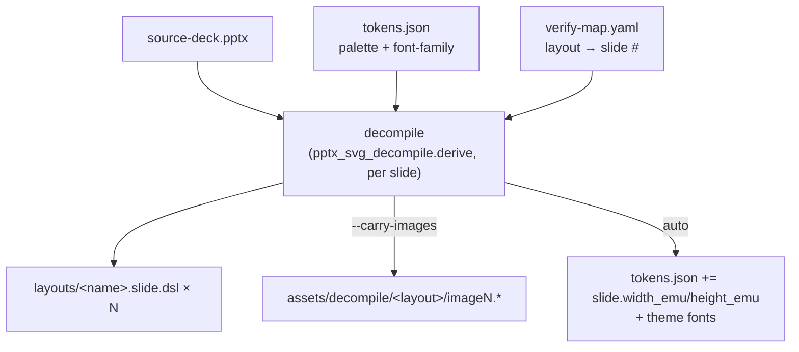
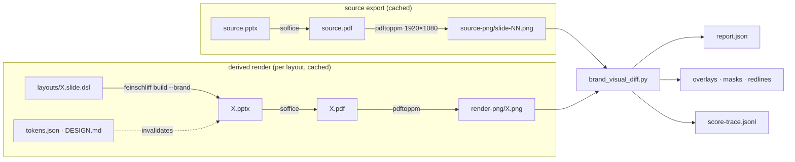
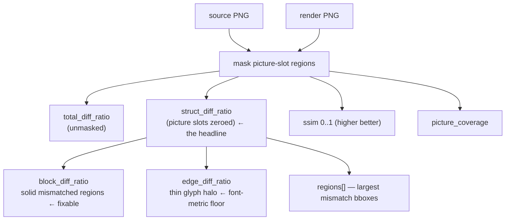
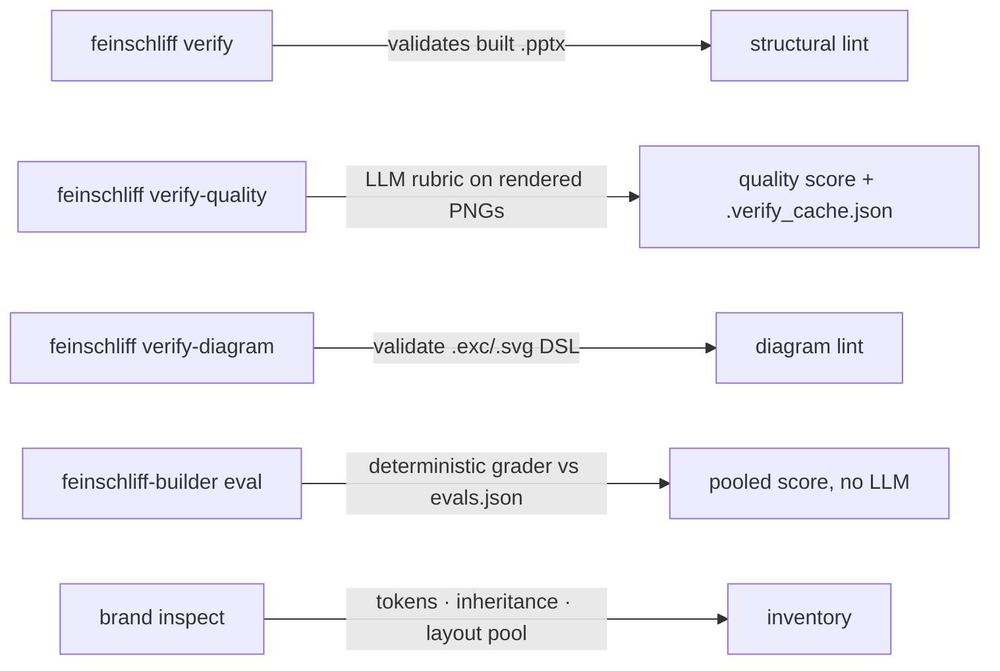
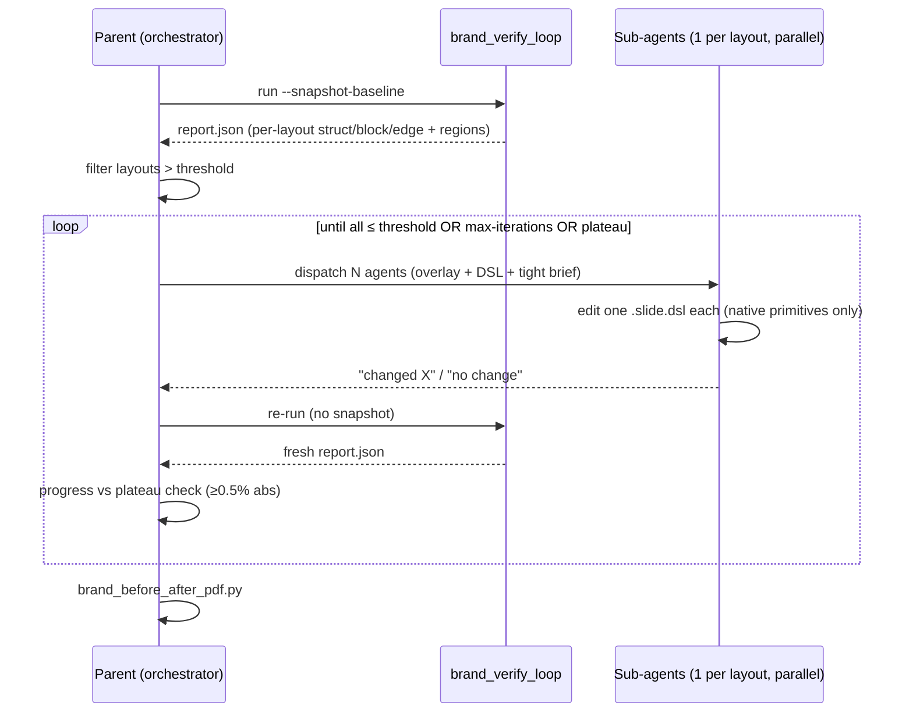
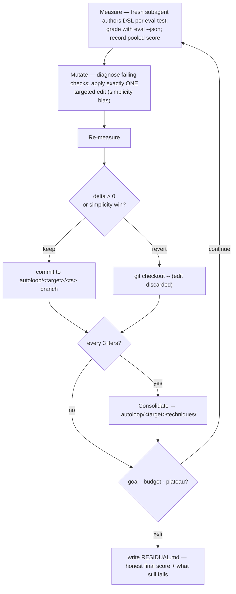
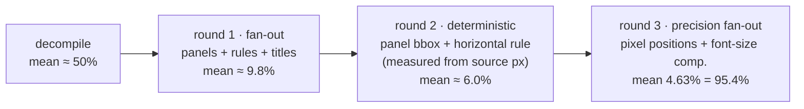

# Improvement & verification loops

`feinschliff-builder` is the authoring + QA toolkit behind the brand packs. Its
job is to make brand-pack quality **measurable** and then to **close the loop**:
measure a target against a deterministic (or rubric) grader, change one thing,
re-measure, keep or revert. This document maps every built-in improvement loop
and the verification mechanisms they stand on.

> **Philosophy — "loops are the new prompts."** The only durable artifact is a
> grader. Given a grader you trust, an improvement *loop* (run by a script, by
> Claude, or by Claude fanning out sub-agents) drives a target toward the goal.
> Everything below is either a **grader** (verification) or a **loop** that rides
> one.

## The three phases



- **Capture** turns a source (a finished `.pptx`, or a hand-authored
  claude-design HTML) into a brand pack. Capture is a **core** capability — see
  [`feinschliff/docs/brand-pack-contract.md`](../../feinschliff/docs/brand-pack-contract.md).
- **Verify** scores how close the pack's render is to the source.
- **Improve** edits the DSL and re-verifies until the score clears the bar.

---

## Capture: source → brand pack



| Command | What it does |
| --- | --- |
| `feinschliff-builder compile-html <html> -o layouts/ --theme <b>` | One `<section data-slots>` → one `.slide.dsl` **skeleton** (slot schema + canvas + theme + TODO body). |
| `feinschliff-builder decompile <pptx> --brand <b> -o <dir> [--with-svg]` | Inverse of `build`: each slide → one `.slide.dsl`, reverse-mapping colours/styles through the brand's `tokens.json`. |
| `scripts/brand_decompile_all.py --brand-pack <p> --source-pptx <pptx> [--carry-images]` | Bulk-decompile every layout in `verify-map.yaml`; also records the source slide size + theme fonts into `tokens.json`. `--carry-images` extracts real `<p:pic>` binaries so the verify render shows the source photo (struct-diff then measures *chrome*, not raster noise). |

Bootstrap recipe (the path the `annual-review` pack was built with):

1. Author `tokens.json` (`extends:` a parent brand + the palette).
2. Author `verify-map.yaml` (`<layout-name>: <slide-number>`).
3. `brand_decompile_all.py … --carry-images` → first-pass DSLs.
4. `brand_verify_loop.py …` → see how close the first pass is.
5. `improve-brand` skill → drive each layout to ≤ threshold.

---

## Verify: the grader layer

### `brand_verify_loop.py` — the orchestrator

One command chains **source export → derived render → visual diff**, with
mtime-keyed caching so a single DSL edit only rebuilds the affected layout.



```bash
uv run python scripts/brand_verify_loop.py \
    --brand-pack brands/<brand> --source-pptx path/to/source.pptx \
    [--only <layouts…>] [--snapshot-baseline] [--skip-source-export] [--loupe]
```

- `--snapshot-baseline` copies the first render set into `render-png.before/`
  so a before/after PDF can be composed later. Use it on the **first** run of an
  improve-brand loop.
- A layout that fails to build/render has its stale PNG dropped and is **excluded**
  from `report.json` rather than scored against a stale render — `report.json`
  never presents stale results as current.

### `brand_visual_diff.py` — what the metrics mean



| Metric | Meaning | Use |
| --- | --- | --- |
| `total_diff_ratio` | Fraction of pixels differing > 30/255, whole canvas, unmasked. | Sanity. |
| **`struct_diff_ratio`** | Same, but **picture slots zeroed first** — the *layout-chrome* signal. | **The headline. Target ≤ 0.05 (= 95%).** |
| `block_diff_ratio` | The struct diff coming from **solid blocks** (a primitive in the wrong place/size/colour). | The **fixable** part — drive this down. |
| `edge_diff_ratio` | The struct diff coming from **thin glyph edges** (sub-pixel text/font-metric mismatch). | A **floor** — don't chase a thin halo tracing text. |
| `ssim` | scikit-image structural similarity, 0–1. | Robust cross-check. |
| `picture_coverage` | Fraction of canvas under picture slots. | > ~50% makes `struct_diff` unreliable → cross-check ssim. |
| `regions[]` | Largest connected mismatch components (bbox + centroid). | Tells a sub-agent *which primitive* to fix. |

Companion graders:

| Script | Role |
| --- | --- |
| `scripts/brand_source_extract.py` | Crop source slides at each picture-slot / chart bbox → `<brand>/assets/source-*` (bootstrap so the render has real assets to mask against). |
| `scripts/brand_plateau.py` | After ≥3 runs with no movement, flag plateaued layouts and route them to a category (clean / fine-tuning / structural / rewrite). |
| `scripts/brand_compare_pdf.py` | Clean side-by-side source vs render PDF (no diff mask) — stakeholder review. |
| `scripts/brand_before_after_pdf.py` | source ↔ baseline ↔ final + score delta per layout — the artifact a reviewer opens to judge a loop run. |
| `scripts/dsl_golden_compare.py` | phash-compare one layout's render against **any** reference `.pptx` (hand-saved, design-tool export, prior version). |

### Other built-in verifiers



- **`verify`** validates an already-built deck (geometry, overflow, contract).
- **`verify-quality`** runs an LLM rubric over rendered slides; results cache in
  `.verify_cache.json` keyed by content hash + rubric.
- **`verify-diagram`** + the shared `validate_diagrams` checks run inside both
  `feinschliff build` and `feinschliff deck build` (keep parity across entry points).
- **`eval`** is the deterministic grader the `autoloop` skill rides — it scores
  **already-generated** `.excalidraw`/`.svg` artifacts against a skill's
  `evals/evals.json` via the shared `feinschmiede` validator + brand palette. No
  LLM, so it is free and reproducible.

---

## Improve: the loops

### `improve-brand` — LLM fan-out, one sub-agent per layout

The work set is "every layout whose `struct_diff_ratio` exceeds `--threshold`
(default 0.05)." The parent fans out **one sub-agent per layout, in parallel, in
a single message**; each sub-agent reads only its three PNGs + one DSL and edits
**only** its `layouts/<layout>.slide.dsl`. The parent re-verifies between rounds.



Non-negotiable rules: **one agent per layout** (never shared); **strict scope**
(only its DSL); **no cheating with `picture`** (every *drawn* element — text,
shapes, lines, chart bars, callouts — must be native DSL primitives; `picture`
is reserved for genuine `<p:pic>` raster/photo/logo). On plateau, **switch the
prompt** (a redirection prompt steering toward an untried category — including
*deletion*); stop a layout after 2 plateau rounds.

### `autoloop` — the Karpathy loop for diagram skills

A deterministic `measure → mutate ONE thing → measure → keep/revert →
consolidate` loop that Claude runs itself (riding the built-in `/goal` for
cross-turn persistence). v1 targets the `excalidraw` / `svg` skills, graded by
`feinschliff-builder eval`.



Autonomy rails: all work on `autoloop/<target>/<ts>`, **never `main`**;
budget-bounded; revert-by-default (the branch only accumulates wins); always
write `.autoloop/<target>/RESIDUAL.md` on exit (never claim a pass the grader
didn't confirm).

---

## Metrics → "quality %"

"95% quality" = **`struct_diff_ratio ≤ 0.05`** for a layout (95% of the masked
canvas matches the source). A pack is "done" when every layout clears the bar, or
when the residual is provably the **edge floor** (`block_diff_ratio` already low,
the remainder is the font-metric halo). Per-layout scores append to
`score-trace.jsonl`, so progress and plateaus are auditable.

---

## Worked example — the `annual-review` pack

Built from Microsoft's "Annual Review" gallery template (13 slides) using the
full chain: `brand_decompile_all.py --carry-images` → `brand_verify_loop.py
--snapshot-baseline` → three `improve-brand`-style rounds.



| Round | What changed | Mean `struct_diff` | Layouts ≤5% |
| --- | --- | --- | --- |
| decompile baseline | first-pass DSLs (panels dropped, rules grey, groups collapsed) | ~50% | 2/13 |
| 1 — fan-out | add panel rect, black rule, bold titles, spread collapsed groups | ~9.8% | 4/13 |
| 2 — deterministic | exact panel bboxes + horizontal rules (measured from source pixels) | ~6.0% | 5/13 |
| 3 — precision fan-out | pixel-measured text positions + font-size compensation | **4.63%** | **9/13** |

The 4 still > 5% (introduction 5.8, timeline 6.0, goals-q1 5.6, goals-q2 6.0)
are at the **edge floor**: `block_diff_ratio ≤ 3.6%`, the remainder is the
font-substitution glyph halo (Arial Nova not installed → LibreOffice substitutes
a family that renders larger; see the
[capture-findings note](#known-floors--limitations)).

### Decompiler gaps this run surfaced (feed back into capture)

| # | Gap | Fix shape |
| --- | --- | --- |
| F1 | Slide-master **background** (the pastel panels) not decompiled → panel slides render white. | Emit the effective bg as a full-bleed `rect` / `background`. |
| F2 | Theme part **hardcoded to `theme1.xml`** → font capture silently skipped when the master uses `theme11.xml`. | Resolve master→theme via the slideMaster rels. |
| F3 | Grouped/repeated shapes **collapse to one position** (team photos, timeline columns). | Compose `grpSp` child offsets with the group offset. |
| F4 | Black rules reverse-map to **`fog`** not `ink`. | Tighten stroke nearest-token match. |
| F5/F6 | Title **bold/size lost**; sibling textboxes **merged**. | Capture run `b="1"` + `sz`; one `text` per box. |
| F7 | Theme **colour scheme not captured** into tokens. | Read `<a:clrScheme>` → seed palette tokens (capture-is-core). |

## Known floors & limitations

- **Font-substitution edge floor** — without the source's theme fonts installed,
  source and brand renders substitute differently; layouts get size-compensated to
  match the *render*, leaving an irreducible `edge_diff_ratio`. Install/bundle the
  theme fonts (or normalise font resolution) to remove it.
- **Picture-coverage bias** — when `picture_coverage` is high, `struct_diff_ratio`
  is unreliable; cross-check `ssim` + absolute pixel count.
- **Stroke-width metric trap** — thinning a stroke can improve the metric while
  looking worse; watch for positional drift hiding as a "stroke-width win."

See `skills/compile/references/techniques/INDEX.md` for the full, brand-agnostic
technique catalogue.
