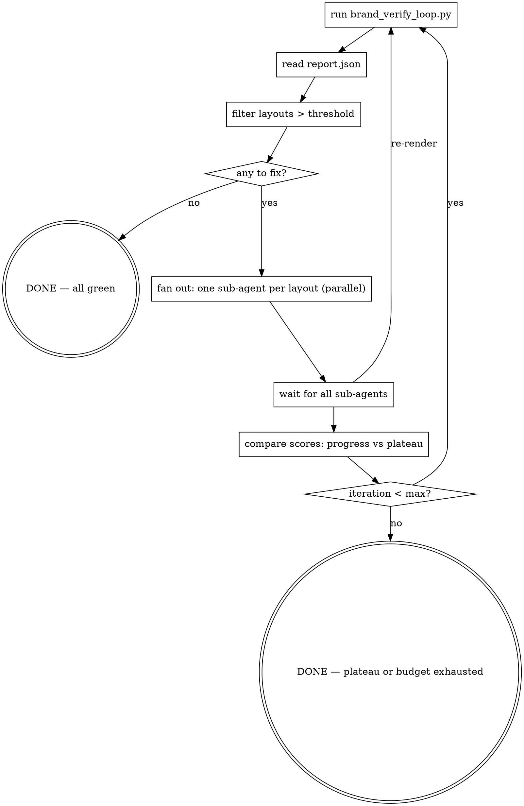

# improve-brand — operational detail

Expanded detail behind the checklist and rules in `SKILL.md`.

## Inputs

| Argument            | Required | Default                                   |
| ------------------- | -------- | ----------------------------------------- |
| `--brand-pack`      | yes      | —                                         |
| `--source-pptx`     | yes      | —                                         |
| `--threshold`       | no       | `0.05` (struct_diff_ratio)                |
| `--max-iterations`  | no       | `3`                                       |
| `--only`            | no       | all layouts in `verify-map.yaml`          |
| `--output-dir`      | no       | `out/<brand>/verify-loop`                 |

## Process



## Checklist (full detail)

You MUST create a task for each of these items and complete them in order:

1. **Run the verify loop with `--snapshot-baseline`** —
   `python ${CLAUDE_PLUGIN_ROOT}/scripts/brand_verify_loop.py --brand-pack <path>
   --source-pptx <path> --snapshot-baseline`
   (requires a dev checkout with `uv sync` for the numpy/scikit-image scoring deps).
   This builds, renders, and diffs every layout in `verify-map.yaml`,
   AND copies the first-iteration renders into `render-png.before/`
   so step 10 can compose a before/after PDF.
2. **Read `<output-dir>/diff/report.json`** to get per-layout
   `struct_diff_ratio`, `picture_coverage`, and overlay paths.
3. **Filter to the work set** — layouts whose `struct_diff_ratio`
   exceeds `--threshold`.
4. **Fan out sub-agents** — issue ONE message containing one `Agent`
   tool call per layout in the work set so they run **in parallel**.
   Each sub-agent's prompt MUST be self-contained (see the per-slide
   prompt template in `references/per-slide-prompt.md`).
5. **Wait for every sub-agent to return.** Treat any sub-agent that
   says "no change made" as that-layout-plateaued for this round.
6. **Re-run the verify loop** to score the new edits (no
   `--snapshot-baseline` — the baseline is already locked in).
7. **Plateau check** — if no layout's score improved by ≥ 0.5%
   absolute since last iteration, stop early.
8. **Iterate** until all layouts ≤ threshold OR
   `--max-iterations` exhausted OR plateau detected.
9. **Final report** — print one line per layout: starting score →
   ending score → verdict (green / improved / plateau / regressed).
10. **Produce the before/after PDF** —
    `python ${CLAUDE_PLUGIN_ROOT}/scripts/brand_before_after_pdf.py --brand-pack <path>`
    (requires dev checkout with scoring deps).
    Writes `<output-dir>/before-after.pdf` — one page per layout with
    the source, baseline render, and final render side-by-side, plus
    the score delta in the header. This is the artifact a reviewer
    opens to judge whether the iteration was worth running.

### Image carry-over for pipeline-optimization runs

When iterating to evaluate **the pipeline itself** (e.g. driving the
hybrid decompiler / verify loop's structural fidelity), pass
`--carry-images` to the **initial** `brand_decompile_all.py` call:

```bash
python ${CLAUDE_PLUGIN_ROOT}/scripts/brand_decompile_all.py \
    --brand-pack <path> --source-pptx <path> --carry-images
```
> **Requires dev checkout:** clone the repo and run `uv sync` — the script
> depends on numpy/scikit-image which are not bundled in the plugin wheelhouse.

This extracts every `<p:pic>` binary from the source slide into
`<brand-pack>/assets/decompile/<layout>/imageN.<ext>` and rewires the
DSL's `default:` slot to point at it. The render then uses the *real*
source picture, so `total_diff_ratio` becomes meaningful (no
picture_coverage masking needed) and the visual diff measures shape +
text fidelity alone.

Use carry-images for self-test runs. Don't use it when authoring a
brand-neutral template — the genericised brand pack should default to
the brand's own placeholder.

## Sub-agent dispatch rules (full)

- **One agent per layout.** Never share an agent across layouts —
  contexts collide and edits step on each other.
- **Parallel by default.** Send all `Agent` tool calls in a SINGLE
  assistant message. The runtime fans them out concurrently; serial
  dispatch wastes wall time and doubles cache misses.
- **Read-only context.** Each sub-agent gets file paths in its prompt;
  do not paste DSL or PNG bytes inline. Sub-agents read what they need.
- **Strict scope.** Each sub-agent may only edit
  `<brand>/layouts/<layout>.slide.dsl` (and, with explicit permission,
  `<brand>/tokens.json` for that layout's style overrides). It MUST
  NOT touch other layouts, the source PPTX, or pipeline scripts.
- **No git side effects.** Sub-agents edit files only; the user controls
  commits.
- **No cheating with pictures.** Every drawn visual element in the
  source — text, rects, shapes, lines, callout boxes, ring/pie sectors,
  flag rosettes, simple chart bars, icons — MUST be reproduced as
  native DSL primitives. Sub-agents may NOT save the source slide as
  a PNG and emit a `picture` statement covering it, NOR extend an
  existing picture bbox to absorb adjacent decoration. The `picture`
  primitive is reserved for genuine `<p:pic>` elements in the source
  XML (real raster art, photographs, the brand logo). The whole
  point of the verify loop is to prove the DSL pipeline can
  reproduce the slide; substituting bitmaps invalidates the test.
  Sub-agents that catch themselves thinking "easier to just make
  this a picture" must STOP and decompose into primitives instead.

## Plateau handling (read before iteration 2)

Once a layout's score stops moving — or worse, regresses — same-direction
nudging makes it worse. Full rules in
[`references/plateau-handling.md`](plateau-handling.md); the sub-agent prompt to
dispatch on plateau/regression is
[`references/redirection-prompt.md`](redirection-prompt.md). Core ideas:

- Log every iteration's outcome to
  `<output-dir>/attempts/<layout>.jsonl` so the next sub-agent has
  failure-context (the missing invariant in most "iterate" loops).
- On plateau/regression, switch the prompt — don't re-dispatch the
  standard one. The redirection prompt explicitly steers the agent
  toward a category of change that has NOT been tried (deletion,
  restructuring, different style token, different theory).
- **Deletion is a legitimate redirection move.** Plateau often
  comes from accumulated bloat. Don't add length.
- Stop the layout after 2 consecutive plateau rounds OR a
  regression that repeats after revert + retry — the agent is out
  of hypotheses.
