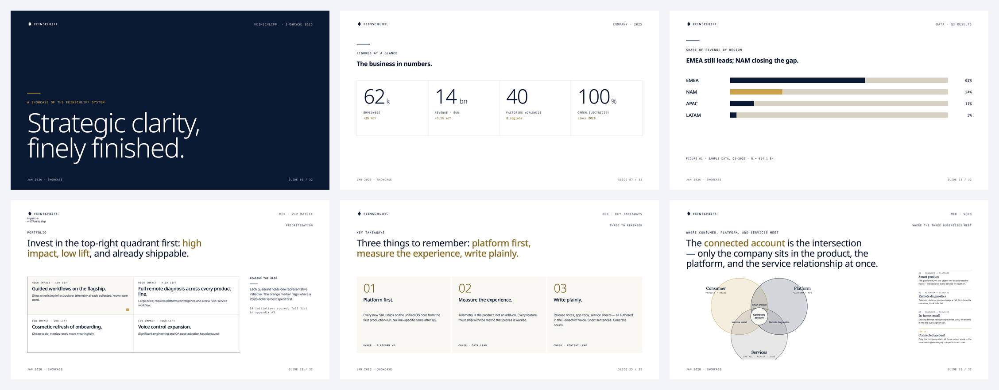
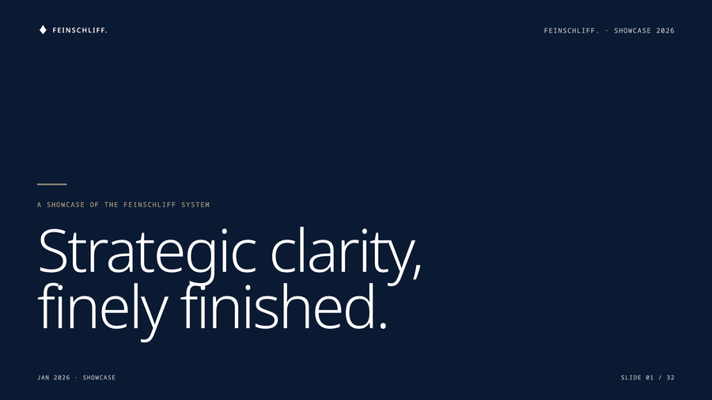

# feinschliff (v0.3 — DSL pipeline)

> *Feinschliff* — German for "fine polish." Brand-pluggable design system that builds `.pptx` decks from a DSL + per-brand tokens.

🎨 **[Browse the brand gallery →](https://marsmike.github.io/feinschliff/brands/)** — every brand pack rendered against every layout.



## What it does

Four Claude Code skills, one CLI:

- **`/deck`** — create or polish a brand-compliant `.pptx` from a brief or rough deck.
- **`/compile`** — scaffold v2 `.slide.dsl` skeletons from claude-design HTML.
- **`/excalidraw`** — author concept-flow diagrams in a brand-aware DSL.
- **`/svg`** — author SVG infographics and custom charts in a brand-aware DSL.

Under the hood: `feinschliff build` / `deck build` / `compile-html` / `verify` / `ship`. See [`docs/architecture.md`](docs/architecture.md) for the full pipeline — five phases, 14-class verify pass, iteration budget.



## Quick start

```bash
# In Claude Code
/plugin marketplace add marsmike/feinschliff
/deck "Q1 update: 12 launches, 3 customers, $4.2M ARR"

# Pick a different palette
FEINSCHLIFF_BRAND=catppuccin-macchiato /deck "..."
```

Standalone Python build (no Claude Code required):

```bash
cd feinschliff
uv run feinschliff build layouts/quote.slide.dsl \
  --brand feinschliff --content tests/fixtures/layouts/quote.yaml -o /tmp/out.pptx
```

## Brand packs (12 ship in the box)

| Pack | License |
|---|---|
| `feinschliff` (default), `feinschliff-dark` | MIT |
| `catppuccin-latte`, `catppuccin-macchiato` | MIT |
| `solarized-dark`, `nord`, `gruvbox-dark` | MIT |
| `gs-ramspau` | proprietary (school-domain pack with 6 bespoke layouts) |
| `claude`, `binance`, `ferrari`, `spotify` | demo only — trademarked |

Author your own from a `DESIGN.md` + `tokens.json` — see [`docs/port-your-brand.md`](docs/port-your-brand.md). Full contract: [`references/brand-pack-spec.md`](references/brand-pack-spec.md).

## Documentation

- [`docs/architecture.md`](docs/architecture.md) — pipeline walkthrough with diagrams
- [`docs/brand-system.md`](docs/brand-system.md) — DESIGN.md authoring + bake recipe + WCAG gates
- [`docs/dsl-grammar.md`](docs/dsl-grammar.md) — DSL primitive reference
- [`docs/port-your-brand.md`](docs/port-your-brand.md) — new-brand tutorial
- [`references/brand-pack-spec.md`](references/brand-pack-spec.md) — brand-pack contract
- [`references/compounds.md`](references/compounds.md) — standard compound catalog

## License

MIT — see repo root `LICENSE`. Third-party attribution: [`NOTICE.md`](NOTICE.md).
