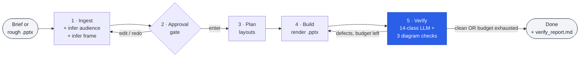

# feinschliff (v0.3 — DSL pipeline)

> *Feinschliff* — German for "fine polish." Brand-pluggable design system that builds `.pptx` decks from a DSL + per-brand tokens. Ships 12 brand packs (8 openly-licensed: Catppuccin family, Solarized, Nord, Gruvbox, plus the eponymous Feinschliff variants — all MIT). Bring your own brand by authoring a single `tokens.json` + `DESIGN.md`.


## What it does

Two Claude Code skills + a thin CLI:

- **`/deck`** — create or polish a brand-compliant `.pptx` from a brief or rough deck. Picks layouts via structured scoring (role, concept_count, data_quantity, comparison, narrative_role, diagram_kind), composes a multi-slide deck, enforces layout variety, and runs a verify pass before declaring done.
  - `/deck "content brief"` — new deck from a brief
  - `/deck polish rough.pptx` — reflow an existing deck into v2 layouts
  - `/deck polish rough.pptx --refurbish-all` — reflow + extract embedded diagrams into editable brand-perfect DSL
  - `/deck critique existing.pptx` — read-only defect analysis

- **`/compile`** — scaffold v2 `.slide.dsl` skeletons from a claude-design HTML or other source. The "add 41 layouts for a new brand in one command" path.

- **`/excalidraw`** — author standalone concept-flow diagrams (architectures, flows) in a compact brand-aware DSL. Output: `.excalidraw` JSON + rendered PNG, brand colors resolved from the active token set.

- **`/svg`** — author standalone SVG infographics and custom charts in a compact brand-aware DSL. Output: `.svg` + rendered PNG; literal hex colors rejected at parse time in favour of semantic names.

Under the skills, four CLI commands do the work:

| Command | Purpose |
|---|---|
| `feinschliff build <layout.slide.dsl> --brand <b> --content <yaml> -o out.pptx` | single-slide render |
| `feinschliff deck build <plan.yaml>` | multi-slide composer |
| `feinschliff deck pick <signals.yaml>` | structured layout picker |
| `feinschliff compile-html <html> -o <out>` | emit `.slide.dsl` skeletons from claude-design HTML |
| `feinschliff verify <pptx> --json` | overlap / out-of-bounds report |
| `feinschliff brand list / inspect <b>` | brand-pack inventory |
| `feinschliff ship <plan.yaml> -o out.pptx` | build + verify + verify-quality, single verdict |

The active brand resolves via `--brand <name>` flag, `FEINSCHLIFF_BRAND` env-var, or default `feinschliff`.

### Content lints

`build` and `deck build` run pre-render content lints by default:

- **`title-length`** — slide titles must be ≤15 words AND ≤2 manual lines.
- **`action-verb-leading`** — items in `actions[]`, `recommendations[]`, `mitigations[]` must begin with an imperative verb (curated whitelist; extend via `FEINSCHLIFF_EXTRA_IMPERATIVES=Foo,Bar`).

Both fail the build before render. Pass `--skip-content-lint` to override (emergency use only).

### One-command ship

`uv run feinschliff ship plan.yaml -o out/deck.pptx` runs build →
verify → verify-quality (offline by default) and emits
`out/ship_report.md` with a single pass/fail verdict. Use `--llm` to
run the LLM rubric live (requires `ANTHROPIC_API_KEY`).


## How it works

Five phases, one approval gate, one verify-iterate loop:



The verify pass runs **14 LLM defect classes** in parallel — five visual (overflow, empty placeholder, layout mismatch, brand violation, density) and nine rhetorical (claim-title, one-idea, bullet-dump, audience-mismatch, red-line-break, curse-of-knowledge, redundancy-overload, truncated-y-axis, missing-baseline). Additionally, **3 deterministic diagram defect classes** run at build time (diagram-overflow, diagram-color-mismatch, diagram-text-too-small) — these fire without an LLM call. The deck only ships when all checks are green, or when the iteration budget exhausts (3 default / 6 perfectionist) and the user approves the remaining defects.

The pipeline also expands `excalidraw {…}` and `svg {…}` diagram blocks embedded in any layout, resolving diagram colors against the active brand's token set, between the slot-interpolation and compound-expansion phases.

📖 **Full walkthrough with all diagrams:** [`docs/architecture.md`](docs/architecture.md) — every phase, the 14 verify classes explained, the iteration budget mechanic, and how `/compile`, `/excalidraw`, and `/svg` fit in.

## Quick start

```bash
# Install via the marsmike/feinschliff marketplace
/plugin marketplace add marsmike/feinschliff

# Use the default feinschliff brand
/deck "Q1 update: 12 launches, 3 customers, $4.2M ARR"

# Use a different open palette
FEINSCHLIFF_BRAND=catppuccin-macchiato /deck "..."
```

Inspect the bundled brand inventory:

```bash
cd feinschliff
uv run feinschliff brand list
uv run feinschliff brand inspect feinschliff
```

## Brand packs (v0.3)

12 brand packs ship in the box: 8 openly-licensed (MIT) and 4 demo-only
trademarked ones, plus one proprietary school-domain pack. Each is a directory
under `feinschliff/brands/<name>/` with `tokens.json` + `DESIGN.md` (minimum).
Layouts are inherited from the toolkit's 43 shared `.slide.dsl` files.

| Pack | License | Notes |
|---|---|---|
| `feinschliff` (default) | MIT | Indigo + Noto Sans — canonical base. |
| `feinschliff-dark` | MIT | Inverted-canvas dark variant. |
| `catppuccin-latte` | MIT | Catppuccin light flavor. |
| `catppuccin-macchiato` | MIT | Catppuccin dark-medium flavor. |
| `solarized-dark` | MIT | Ethan Schoonover's classic. |
| `nord` | MIT | Nordic blue palette. |
| `gruvbox-dark` | MIT | Retro groove dark palette. |
| `gs-ramspau` | proprietary | School-domain pack with 6 bespoke layouts. |
| `claude`, `binance`, `ferrari`, `spotify` | demo only | Trademarked — not for redistribution. |

Four additional reference packs (`claude`, `binance`, `ferrari`, `spotify`)
ship as **demo only** — trademarked, not for redistribution.

Authoring a new brand is a single `DESIGN.md` plus a bake call. See
[`docs/brand-system.md`](docs/brand-system.md) for the recipe with
mermaid diagrams.

## Pipeline (v2)

Decks are composed from three building blocks: `.slide.dsl` layouts
(declarative composition), brand `tokens.json` (palette + sizes), and
content YAML (per-slide values). The v2 emitter walks the DSL +
tokens + content to produce a `.pptx`.

| Authored | Lives at | Inherited from |
|---|---|---|
| `.slide.dsl` layout | `feinschliff/layouts/` (33 toolkit) + `brands/<b>/layouts/` (brand-only) | toolkit by default |
| Compound (header/footer/card/…) | `feinschliff/compounds/` + `brands/<b>/compounds/` | toolkit by default; brand overrides win |
| Tokens | `brands/<b>/tokens.json` (+ optional `extends: <parent>`) | parent brand on extends |
| Content | yaml file or inline in a plan | none — fully per-deck |

See [`docs/dsl-grammar.md`](docs/dsl-grammar.md) for the primitive
syntax and [`references/brand-pack-spec.md`](references/brand-pack-spec.md)
for the brand-pack contract.

## Bring your own brand

Two steps for a palette-only brand:

```bash
mkdir -p feinschliff/brands/myco/compounds
cat > feinschliff/brands/myco/tokens.json <<'EOF'
{ "$schema": "…", "color": { "$type": "color", "accent": { "$value": "#FF5722" }, … } }
EOF
cat > feinschliff/brands/myco/DESIGN.md <<'EOF'
---
name: My Co
extends: feinschliff
---
EOF
# author brands/myco/compounds/{header,footer,header-dark,footer-dark}.dsl

uv run feinschliff brand inspect myco
uv run feinschliff build layouts/quote.slide.dsl --brand myco --content examples/v2/quote.yaml -o /tmp/myco.pptx
```

Full walkthrough:
[`docs/port-your-brand.md`](docs/port-your-brand.md). Contract:
[`references/brand-pack-spec.md`](references/brand-pack-spec.md).

## Structure

```
feinschliff/
├── brands/
│   ├── feinschliff/                   MIT — canonical base
│   │   ├── DESIGN.md                  brand narrative + frontmatter (extends?)
│   │   ├── tokens.json                DTCG design tokens (palette + sizes + asset_sources)
│   │   ├── compounds/                 brand-specific header/footer/marks
│   │   ├── assets/                    gem icon + illustrations
│   │   └── claude-design/             optional HTML design source
│   ├── gs-ramspau/                    domain-specific (school) — 6 bespoke layouts
│   ├── feinschliff-dark/              MIT inverted-canvas variant
│   ├── catppuccin-latte/, -macchiato/ MIT Catppuccin (light + dark)
│   ├── solarized-dark/                MIT
│   ├── nord/, gruvbox-dark/           MIT
│   └── claude/, binance/, ferrari/,   demo-only (trademarked)
│       spotify/
├── layouts/                           33 toolkit-shared .slide.dsl files
├── compounds/                         toolkit-shared compounds (card, card-q, kpi-cell, agenda-item, mck-head)
├── examples/v2/                       per-layout content fixtures
├── lib/
│   ├── dsl/                           DSL parser + expander + pptx emitter
│   ├── brand_discovery.py             v2 brand-pack discovery
│   ├── layout_picker.py               structured layout scoring
│   ├── layout_validator.py            overlap + out-of-bounds checks
│   └── design_md.py, content_validator.py, slot_budget.py, …
├── cli/
│   ├── main.py                        feinschliff CLI entry
│   ├── build.py                       single-slide render
│   ├── deck.py                        multi-slide composer + picker
│   ├── compile.py                     HTML → skeleton emitter
│   ├── brand.py                       brand list / inspect
│   └── verify.py                      validator (text JSON output)
├── scripts/
│   ├── dsl_golden_compare.py          DSL → PNG vs golden phash
│   ├── render_brand_atlas.py          per-brand × per-layout PNG gallery
│   └── …                              brand-gallery tooling
├── skills/
│   ├── deck/SKILL.md                  /deck
│   └── compile/SKILL.md               /compile
├── docs/
│   ├── dsl-grammar.md                 DSL primitive reference
│   ├── port-your-brand.md             new-brand tutorial
│   ├── architecture.md                pipeline walkthrough
│   └── migration-dsl-architecture.md  v1 → v2 migration plan (historical)
├── references/
│   ├── brand-pack-spec.md             v2 brand-pack contract
│   └── compounds.md                   standard compound catalog
├── tests/                            brand discovery, layout picker, content + chrome verify
├── CHANGELOG.md
├── README.md
└── NOTICE.md                          third-party attribution
```

## What this is NOT

- Not a SaaS — runs locally; no account, no telemetry, no cloud rendering.
- Not a slide editor — feinschliff generates `.pptx` files; edit them in PowerPoint, Keynote, or Google Slides.
- Not married to any specific brand — the eponymous default exists so the system has a brand to demonstrate against; bring your own.
- Not a replacement for design judgment — `/deck` enforces brand and runs a 14-class verify pass, but the narrative and content still need a human author.
- Not built for hand-tweaking individual shapes — the model is "compose from layouts," not "free-form canvas."

## FAQ

**Do I need an Anthropic API key?**
You need Claude Code installed and authenticated. The plugin runs through Claude Code's skill system; no separate API key.

**Can I use this without Claude Code?**
The Python renderer (`build.py`) runs standalone and produces `.pptx` files from a brand pack. The `/deck`, `/compile`, `/excalidraw`, and `/svg` skill workflows are Claude Code-specific.

**Why is it called *Feinschliff*?**
German for "fine polish" — the last 10% of brand-compliance work that usually gets dropped under deadline. The plugin automates that step.

**Can I add my own brand?**
Yes — that's the point. Author a `DESIGN.md` (Google's open spec) under `feinschliff/brands/<name>/`, run `scripts/bake_palette.py from-design-md --brand <name> --base feinschliff`, set `FEINSCHLIFF_BRAND=<name>`. See [`docs/brand-system.md`](docs/brand-system.md) for the full recipe.

**Why not just use Marp / Slidev / Tome / Beautiful AI?**
See the comparison below — feinschliff's wedge is `.pptx` output, brand-pluggable token systems, and a 14-class verify pass that catches both visual and rhetorical defects.

**How do I report a bug?**
[Open an issue](https://github.com/marsmike/feinschliff/issues/new/choose) — the bug-report template walks you through the required info.

## Compared to alternatives

| Tool | Output format | Brand-pluggable | Theory checks | Open source |
|---|---|---|---|---|
| **feinschliff** | `.pptx` (native PowerPoint) | yes — token-driven brand packs | 14-class verify (visual + rhetorical) | MIT |
| Marp | `.html` / `.pdf` / `.pptx` | CSS theme | none | MIT |
| Slidev | `.html` / `.pdf` | Vue/CSS | none | MIT |
| Beautiful AI | proprietary | template chooser | none | proprietary SaaS |
| Tome | proprietary | template chooser | none | proprietary SaaS |
| Gamma | proprietary | template chooser | none | proprietary SaaS |

The wedge is the combination: **`.pptx` users actually edit + brand-pluggable token system + verify pass that catches one-idea-per-slide / claim-title / curse-of-knowledge violations, not just visual overflow.**

## Roadmap

- [x] **v0.1.0** — `feinschliff` brand pack, three skills, MIT.
- [x] **v0.1.x** — six initial brand packs (Feinschliff, Claude, Spotify, Binance, BMW, Ferrari) on the v1 Baukasten Python renderer.
- [x] **v0.2** — v2 catalog architecture. Programmatic Baukasten replaced by 34 baked single-slide templates per brand + `lib/pptx_fill`. Unified `DESIGN.md` brand contract (Google's open spec). 11 openly-licensed brand packs ship in the box (Catppuccin family, Solarized, Nord, Dracula, Gruvbox, Feinschliff variants).
- [ ] **v0.3** — accept any `DESIGN.md` from [VoltAgent/awesome-design-md](https://github.com/VoltAgent/awesome-design-md) (Stripe, Vercel, Linear, Notion, …) as drop-in brand input. Component-level fidelity beyond palette swap.
- [ ] **v0.4** — pluggable verify-pass rule library; users add their own defect classes.
- [x] **v0.5** — Partially shipped: SVG renderer parity via `/svg` skill + `svg-infographic` layout; Excalidraw concept-diagram surface via `/excalidraw` skill + `excalidraw-diagram` layout; `/deck polish --refurbish-all` extracts and rebuilds diagrams from rough PPTX into editable brand-perfect DSL. Remotion animation parity remains pending.
- [ ] **v1.0** — first feedback-driven major; API stability commitment.

## License & attribution

MIT — see repo root `LICENSE`. Third-party attribution: [`NOTICE.md`](NOTICE.md).

## References

- [`docs/architecture.md`](docs/architecture.md) — full pipeline walkthrough with diagrams (`/deck`, `/compile`, `/excalidraw`, `/svg`).
- [`docs/brand-system.md`](docs/brand-system.md) — DESIGN.md authoring + bake recipe + drift/WCAG gates.
- [`references/brand-pack-spec.md`](references/brand-pack-spec.md) — contract for authoring a new brand pack.
- [`references/compounds.md`](references/compounds.md) — standard compound catalog (callout, kpi, etc.).
