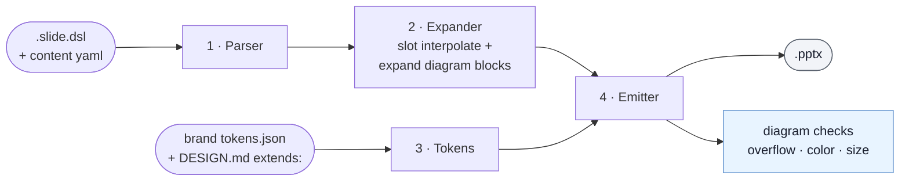
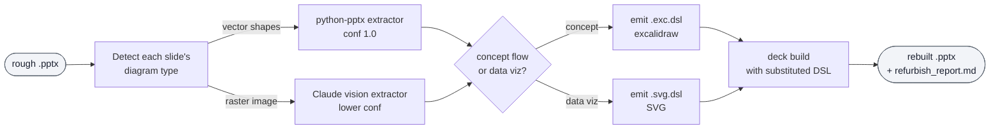

# How feinschliff works

Reference for the v2 pipeline. Slides are authored as `.slide.dsl`
files, expanded against a brand pack's `tokens.json`, and emitted to
`.pptx` via python-pptx. Three things ship in the box: a primitive
DSL (`feinschliff/lib/dsl/`), 43 toolkit layouts at `feinschliff/layouts/`
that every brand inherits, and a CLI (`feinschliff …`) that drives
the pipeline end-to-end.

For the v1 → v2 history (placeholder-fill engine, `catalog.json`,
frozen-template corpus), see
[`migration-dsl-architecture.md`](migration-dsl-architecture.md).

## Pipeline

### Stage 1 — Parser (`lib/dsl/parser.py`)

Line-oriented regex parser. Each non-comment line becomes a `DSLNode`:
primitive (`text`, `rect`, `line`, `picture`, `shape`),
compound call, or compound definition. Quoted-string labels with
`\n`/`\t` escapes, `key:value` kwargs, and `{{ … }}` placeholders
are preserved verbatim — interpretation belongs to the expander, not
the parser. A `.slide.dsl` file is one slide; a `compounds/*.dsl`
file holds one or more `compound name(params):` definitions.

### Stage 2 — Expander (`lib/dsl/expander.py`)

Two passes over the node list. First pass: resolve `{{ EXPR }}`
slot interpolation against the content map (top-level slides) or
the call's bindings (inside a compound body). Supports dotted/indexed
paths, default literals, and multi-op arithmetic (`{{ y+h-1 }}`).
Between the two passes, **diagram blocks** (`excalidraw {…}` and
`svg {…}`) are expanded: the diagram DSL is parsed, colors resolved
against the active brand's `lib.diagrams.brand_bridge`, and the block
replaced with a `picture` primitive pointing at the rendered PNG.
Second pass: recursively replace compound-call nodes with their
parameter-substituted bodies until only primitives remain. Brand-local
compounds at `brands/<brand>/compounds/` override toolkit compounds
at `feinschliff/compounds/` on name collision. Nodes with `if:`
that resolves to empty/false are dropped.

### Stage 3 — Tokens (`lib/dsl/tokens.py`)

Loads `brands/<brand>/tokens.json` (DTCG format) and walks any
`extends:` chain declared in `DESIGN.md` frontmatter, merging
parent tokens with child overrides. Style refs in the DSL
(`style:title`, `style:eyebrow`, …) resolve through the
`STYLE_BUNDLES` table to a (font-family, size, weight, color)
quadruple. Color refs (`fill:accent`, `color:graphite`) resolve
directly against the merged color map.

### Stage 4 — Emitter (`lib/dsl/pptx_emit.py`)

Consumes the primitive node list plus the resolved Tokens bundle,
builds a single-slide `Presentation` via python-pptx. Coordinates
map 1 design-px → 6350 EMU on a 1920×1080 canvas. Each primitive
becomes a python-pptx shape: `text` → text frame with autofit and
soft-hyphenation, `rect`/`shape` → MSO_SHAPE with fill/stroke from
tokens, `line` → connector, `picture` → image with cover/contain
sizing. Font-weight numbers map to the corresponding Noto Sans face
name so soffice picks up the right weight at render time.

## Brand-pack loading

`lib/brand_discovery.py` searches in order:

1. `FEINSCHLIFF_BRAND_PATH` env var.
2. `~/.feinschliff/brands/`.
3. Installed Claude Code plugin `brands/` dirs under
   `~/.claude/plugins/`.
4. Walking up from `$CWD` until a `feinschliff/brands/` checkout is
   found.
5. The bundled `feinschliff/brands/` shipped inside the package.

Each discovered brand exposes optional `tokens_path`, `design_path`,
`layouts_path`, `compounds_path`. `DESIGN.md` frontmatter may declare
`extends: <parent-brand>`; the tokens loader walks the chain and
merges parent → child so a child brand only needs to list overrides.
Toolkit layouts at `feinschliff/layouts/` are inherited by every
brand; a brand may override one by dropping a file with the same
stem into `brands/<brand>/layouts/`.

## CLI surface

Defined in `cli/main.py`; each subcommand has its own module under
`cli/`.

| Command | Module | What it does |
|---|---|---|
| `feinschliff brand list` | `cli/brand.py` | Enumerate discovered brand packs |
| `feinschliff brand inspect <name>` | `cli/brand.py` | Show v2 inventory (tokens, layouts, compounds) for one brand |
| `feinschliff compile-html <html>` | `cli/compile.py` | Walk a claude-design HTML; emit one `.slide.dsl` skeleton per `<section data-slots>` |
| `feinschliff build <layout.slide.dsl>` | `cli/build.py` | Parse → expand → emit one single-slide `.pptx`. Takes `--brand`, `--content`, `--var key=value`, `-o` |
| `feinschliff deck pick <signals.yaml>` | `cli/deck.py` | Rank toolkit layouts via `lib/layout_picker.py` against (role, concept_count, data_quantity, comparison, narrative_role) signals |
| `feinschliff deck build <plan.yaml>` | `cli/deck.py` | Compose a multi-slide `.pptx` — one slide per plan entry, mixing layouts and brands |
| `feinschliff verify <deck.pptx>` | `cli/verify.py` | Run `lib/layout_validator.py` for overlap + out-of-bounds defects |

The typical authoring loop:

1. `compile-html` produces `.slide.dsl` skeletons from a claude-design
   HTML reference. The skeletons include the slot-schema docstring
   parsed from `data-slots` attributes.
2. `build` renders one layout against a content YAML for a tight
   iteration loop.
3. `deck build` composes the final multi-slide `.pptx` from a
   `plan.yaml` that lists `{ layout, content | content_file }` per
   slide.
4. `verify` is the ship gate — no overlap, no out-of-bounds, run on
   the produced `.pptx`.

## Verify pass — defect classes

Two tiers of checks:

**14 LLM defect classes** (run via `/deck` verify loop):

| Category | Classes |
|---|---|
| Visual (5) | overflow, empty-placeholder, layout-mismatch, brand-violation, density |
| Rhetorical (9) | claim-title, one-idea, bullet-dump, audience-mismatch, red-line-break, curse-of-knowledge, redundancy-overload, truncated-y-axis, missing-baseline |

**Deterministic checks** (run at build time, no LLM):

| Class | What it checks |
|---|---|
| `text-overlap` | Two text boxes overlap each other |
| `out-of-bounds` | A shape extends past the slide canvas |
| `diagram-overflow` | A diagram-internal primitive bbox extends past the diagram region |
| `diagram-color-mismatch` | A rendered color is not in the active brand token set |
| `diagram-text-too-small` | Computed on-slide font size is below the per-role minimum |

The 3 diagram checks are wired into the build step at the only point where `DSLNode` metadata is still live (immediately after diagram block expansion). They fire at `feinschliff build` time and are printed to stderr; the build does not abort.

## Refurbish flow (`/deck polish --refurbish-all`)

Converts embedded diagrams in a rough `.pptx` into editable brand-perfect DSL
and rebuilds the output deck with them substituted back in.

Outputs: `<deck-out>/refurbished/slide-N.{exc.dsl|svg.dsl}` + `refurbish_report.md`. The rebuilt deck has the extracted diagrams in DSL form — brand colors are applied fresh, diagrams are fully editable.

## Where this is implemented

- **DSL pipeline:** [`lib/dsl/parser.py`](../lib/dsl/parser.py), [`lib/dsl/expander.py`](../lib/dsl/expander.py), [`lib/dsl/tokens.py`](../lib/dsl/tokens.py), [`lib/dsl/pptx_emit.py`](../lib/dsl/pptx_emit.py).
- **Brand discovery + tokens:** [`lib/brand_discovery.py`](../lib/brand_discovery.py), [`lib/design_md.py`](../lib/design_md.py).
- **Layout picker:** [`lib/layout_picker.py`](../lib/layout_picker.py) (per-slide affinity scoring) and [`lib/layout_budget.py`](../lib/layout_budget.py) (two-pass deck-wide planner that re-ranks picker output with a usage-budget bonus so eligible-but-overlooked layouts surface across long decks).
- **Layout validator:** [`lib/layout_validator.py`](../lib/layout_validator.py).
- **Toolkit layouts (41):** [`layouts/`](../layouts/).
- **Toolkit compounds (shared):** [`compounds/`](../compounds/).
- **Brand packs (12):** [`brands/`](../brands/).
- **Diagram library:** [`lib/diagrams/`](../lib/diagrams/) — brand_bridge, excalidraw_to_svg, refurbish pipeline.
- **CLI entry:** [`cli/main.py`](../cli/main.py).
- **Grammar contract:** [`dsl-grammar.md`](dsl-grammar.md).
- **Author guide for new brands:** [`port-your-brand.md`](port-your-brand.md).
- **Brand contract:** [`brand-system.md`](brand-system.md), [`../references/brand-pack-spec.md`](../references/brand-pack-spec.md).

## Sister skills

- **`/deck`** drives `feinschliff deck pick` → `deck build` → `verify`
  to produce a multi-slide `.pptx` from a brief.
- **`/compile`** drives `feinschliff compile-html` (plus golden-image
  comparison) to add or regenerate one layout from a claude-design
  HTML or reference render. This is also the path for adding a new
  layout to an existing brand — feed `compile-html` a single-layout
  HTML fragment.
- **`/excalidraw`** and **`/svg`** author brand-aware diagrams via
  compact DSLs; both are inserted into slides through the standard
  diagram-block expander.
