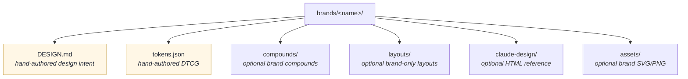

# Brand system

How Feinschliff brand packs are defined, inherited, and discovered in
v2. A brand pack is a `tokens.json` (DTCG format) plus an optional
`DESIGN.md` companion, optionally extended by brand-specific
`compounds/` and `layouts/`. Toolkit layouts and compounds are
inherited automatically — adding a new brand can be as small as one
JSON file + an `extends:` line.

## Overview

A Feinschliff brand pack is a directory under `feinschliff/brands/<name>/`.
The minimum contract is one of:

- `tokens.json` — DTCG-format machine-readable token set.
- `DESIGN.md` — markdown with YAML frontmatter (human-readable design
  intent + inheritance pointer).

Both files are **hand-authored**. The runtime reads `tokens.json` (with
parent merges resolved via `DESIGN.md`'s `extends:` chain). There is no
bake step and no derived artifacts — `tokens.json` is the source of
truth for the machine, `DESIGN.md` is the source of truth for the
human.

The system ships 12 brands today:

| Brand | License | Origin |
|---|---|---|
| `feinschliff` | MIT | Canonical base — navy ramp + warm paper + gold |
| `feinschliff-dark` | MIT | Inverted-canvas variant |
| `catppuccin-latte` | MIT | [catppuccin/palette](https://github.com/catppuccin/palette) — daylight |
| `catppuccin-macchiato` | MIT | [catppuccin/palette](https://github.com/catppuccin/palette) — darker medium |
| `solarized-dark` | MIT | [Ethan Schoonover](https://ethanschoonover.com/solarized/) |
| `nord` | MIT | [nordtheme/nord](https://github.com/nordtheme/nord) |
| `gruvbox-dark` | MIT | [morhetz/gruvbox](https://github.com/morhetz/gruvbox) |
| `gs-ramspau` | proprietary | School-flavoured pack with 6 bespoke layouts |
| `claude`, `binance`, `ferrari`, `spotify` | demo only | Trademarked — not for redistribution |

## Brand directory layout



`tokens.json` and `DESIGN.md` are the only files the runtime needs.
Everything else is optional. Toolkit layouts (`feinschliff/layouts/`,
39 of them) and toolkit compounds (`feinschliff/compounds/`) are
inherited by every brand — a palette-only brand needs no per-brand
layout files at all.

## DESIGN.md format

Single markdown file with YAML frontmatter (machine-readable) and a body
(human rationale). Subset of [Google's open DESIGN.md
spec](https://github.com/google-labs-code/design.md) (Apache 2.0,
April 2026) — spec-compatible so files round-trip with other tools.

```markdown
---
version: 1.0
name: Catppuccin Mocha
description: Dark, soothing pastel theme. Upstream catppuccin/palette (MIT).
extends: feinschliff
colors:
  accent: "#cba6f7"        # mauve
  accent-hover: "#b4befe"
  highlight: "#f5c2e7"
  ink: "#cdd6f4"           # body text on dark canvas
  paper: "#1e1e2e"         # base canvas
  # … remaining slots inherit from feinschliff
typography:
  inherit: feinschliff
---

## Overview

Catppuccin Mocha is the darkest of Catppuccin's four flavors …
```

### Frontmatter contract

| Field | Required | Notes |
|---|---|---|
| `version` | optional | Free-form version tag |
| `name` | required | Display name |
| `description` | optional | One-line summary |
| `extends` | optional | Parent brand id — tokens inherit through the chain |
| `colors` | required | Map of slot-name → 7-char hex `#RRGGBB` |
| `typography` | optional | `inherit: <base-brand>` form supported |
| `spacing`, `rounded`, `components` | optional | Reserved for future use |

`extends:` walks the parent chain at load time (see
`lib/dsl/tokens.py`). A child brand only needs to list the tokens it
overrides; everything else flows through from the parent.

The schema is enforced at `lib/schemas/design-md.schema.json` and
validated by `lib/design_md.parse`.

## `tokens.json` — DTCG, hand-authored

The machine-readable companion. Same content the runtime cares about
(palette, font families, font weights, font sizes, slide tokens),
written in the [DTCG 2025.10 format](https://design-tokens.github.io/community-group/format/).

```jsonc
{
  "$schema": "https://schemas.designtokens.org/draft-2/format.json",
  "color": {
    "$type": "color",
    "accent":      { "$value": "#FF5722" },
    "ink":         { "$value": "#212121" },
    "paper":       { "$value": "#FAFAFA" }
    // …
  },
  "font-family": {
    "$type": "fontFamily",
    "display": { "$value": ["Inter", "Helvetica Neue", "sans-serif"] }
  }
}
```

There is no bake step that derives `tokens.json` from `DESIGN.md`.
Keep them coherent by hand (or by inheriting both from a parent
brand and overriding minimally). See
[`references/brand-pack-spec.md`](../references/brand-pack-spec.md)
for the full required-token list.

## Inheritance via `extends:`

`DESIGN.md` frontmatter declares the parent:

```yaml
---
name: My Brand
extends: feinschliff
---
```

At load time the tokens module walks the chain (child → parent →
grandparent), merges color/font/size/weight maps, and exposes the
flattened bundle to the DSL. A child overrides any slot by setting it
in its own `tokens.json`; missing slots inherit unchanged.

Layouts and compounds inherit via filesystem lookup, not the
`extends:` chain — toolkit-level files are always available, and a
brand-local file with the same stem wins.

## Brand-specific layouts and compounds

Optional per-brand directories:

- `brands/<brand>/compounds/<name>.dsl` — brand-specific compound
  components (e.g. `header`, `footer`, custom marks). Toolkit compounds
  are inherited automatically; a brand-local compound with the same
  name overrides the toolkit version.
- `brands/<brand>/layouts/<name>.slide.dsl` — brand-only layouts that
  the toolkit doesn't cover. `feinschliff brand inspect <name>` lists
  them under `brand-only`.

Most brands (catppuccin, nord, gruvbox-dark, …) ship neither — they're
pure palette overrides. `gs-ramspau` is the maximal example: 6
school-domain layouts (stundenplan, termine, team, leitbild,
statistik, checkliste) plus a handful of bespoke compounds.

## Discovery and inspection

`feinschliff brand list` walks the discovery ladder
(`FEINSCHLIFF_BRAND_PATH` env, `~/.feinschliff/brands/`, installed
plugin `brands/` dirs, CWD-anchored dev checkout, bundled
`feinschliff/brands/`). Each entry shows which artifacts are present
(`tokens`, `design`, `+layouts`, `+compounds`).

`feinschliff brand inspect <name>` prints the v2 inventory: parent
brand from `extends:`, toolkit layouts available, brand-only layouts,
brand compounds, override layouts.

## Validation gates

| Gate | Test | What it catches |
|---|---|---|
| **Schema** | `lib/design_md.parse` | Structurally-invalid DESIGN.md frontmatter |
| **WCAG legibility** | `test_wcag_contrast.py` | At least one of `{ink, black, graphite, off-white}` on `paper` clears WCAG AA Large (3.0:1); accent on paper clears 2.0:1 (decorative floor) |
| **Render sweep** | `test_dsl_pipeline.py` + golden PNGs at `tests/golden/feinschliff/` | Every brand × every toolkit layout parses, expands, emits, and matches the pre-deletion baseline |

## Adding a new brand — recipe

End-to-end walkthrough lives at
[`port-your-brand.md`](port-your-brand.md). Brief version for a
palette-only brand:

```bash
# 1. Scaffold.
mkdir -p feinschliff/brands/tokyo-night
touch feinschliff/brands/tokyo-night/{tokens.json,DESIGN.md}

# 2. Author DESIGN.md with `extends: feinschliff` + colors block.
# 3. Author tokens.json (DTCG) with the palette override.
# 4. Sanity-check.
feinschliff brand inspect tokyo-night

# 5. Smoke-build one slide.
feinschliff build layouts/quote.slide.dsl \
    --brand tokyo-night \
    --content examples/v2/quote.yaml \
    -o /tmp/tokyo-quote.pptx

# 6. Run the test sweep.
uv run pytest -q
```

Time per palette: ~10 minutes, most of it picking colors.

## Dark-brand contrast convention

On brands with a dark canvas (`paper` is a dark color), the neutral
text tokens `ink`, `graphite`, and `steel` must resolve to **light
values** — not to colors that read as dark-on-dark.

The four currently-shipped dark brands follow this rule:

| Brand | `ink` | `graphite` | `steel` |
|---|---|---|---|
| `feinschliff-dark` | `#E8EAF0` | `#9DA3B4` | `#6B7280` |
| `catppuccin-macchiato` | `#CAD3F5` | `#A5ADCB` | `#6E738D` |
| `nord` | `#ECEFF4` | `#D8DEE9` | `#8FBCBB` |
| `gruvbox-dark` | `#EBDBB2` | `#D5C4A1` | `#BDAE93` |

When authoring a new dark brand, override all three of `ink`,
`graphite`, and `steel` to light hex values in `tokens.json`. The
WCAG legibility gate (`test_wcag_contrast.py`) checks `ink`-on-`paper`
and will fail if a dark-canvas brand leaves these at dark values.

## Common pitfalls

- **Slot name typo in `tokens.json`.** Color tokens must match the
  names referenced by the toolkit layouts (`accent`, `ink`, `paper`,
  `graphite`, `fog`, …). The render sweep catches missing tokens at
  layout-fill time.
- **`DESIGN.md` and `tokens.json` drift.** They're independent
  artifacts in v2 — keep them coherent by hand, or have the AI agent
  treat one as derived from the other in your workflow.
- **Color contrast.** The WCAG test requires a readable text-on-paper
  pair. If your palette is all-pastels-on-pastel, pick one slot to be
  the high-contrast text body color before authoring.
- **Dark brand `ink` contrast.** If authoring a dark-canvas brand,
  ensure `ink`, `graphite`, and `steel` resolve to light colors (see
  "Dark-brand contrast convention" above). Dark values on a dark
  background will fail the WCAG legibility gate.
- **Missing required compound.** Toolkit layouts call `header` and
  `footer` compounds — every brand must ship its own at
  `brands/<brand>/compounds/`. Dark-bg layouts also need
  `header-dark` and `footer-dark`.

## Why DESIGN.md alongside `tokens.json`

DTCG `tokens.json` is JSON — great for tools, awkward for humans and
LLMs to author. DESIGN.md adds:

- **Markdown body** for the brand rationale (why these colors, how to
  use them) — useful both as developer docs and as context an AI agent
  can consume when building decks for this brand.
- **YAML frontmatter** at the top is two-clicks easier to skim than nested
  JSON `$value` blocks.
- **Cross-tool portability** — the format is Google-published Apache 2.0,
  so files can be shared with non-Feinschliff tools that read DESIGN.md
  (e.g. [VoltAgent/awesome-design-md](https://github.com/VoltAgent/awesome-design-md)).

`tokens.json` stays as the runtime-friendly DTCG-format machine source.

## Legacy notes

`scripts/bake_palette.py` (the v1 derive-everything-from-DESIGN.md
script that produced `catalog.json`, `templates/pptx/*.pptx`, and
`claude-design/<brand>-2026.html` per brand) is **not part of the v2
build**. If it still sits in the tree, treat it as legacy — v2 brands
hand-author both `tokens.json` and `DESIGN.md` and let toolkit-shared
layouts do the rest. See
[`migration-dsl-architecture.md`](migration-dsl-architecture.md) for
the full v1 → v2 rationale.

## References

- [Google's DESIGN.md spec](https://github.com/google-labs-code/design.md) — Apache 2.0
- [Design Tokens Format Module 2025.10](https://design-tokens.github.io/community-group/format/) — DTCG stable spec
- [VoltAgent/awesome-design-md](https://github.com/VoltAgent/awesome-design-md) — 71 brand examples
- [catppuccin/palette](https://github.com/catppuccin/palette) — MIT
- [Solarized](https://ethanschoonover.com/solarized/) — MIT
- Brand contract reference: [`references/brand-pack-spec.md`](../references/brand-pack-spec.md)
- Port-your-brand walkthrough: [`port-your-brand.md`](port-your-brand.md)
- DSL grammar: [`dsl-grammar.md`](dsl-grammar.md)
