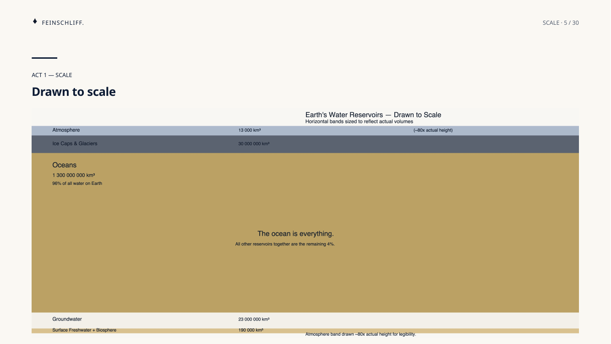
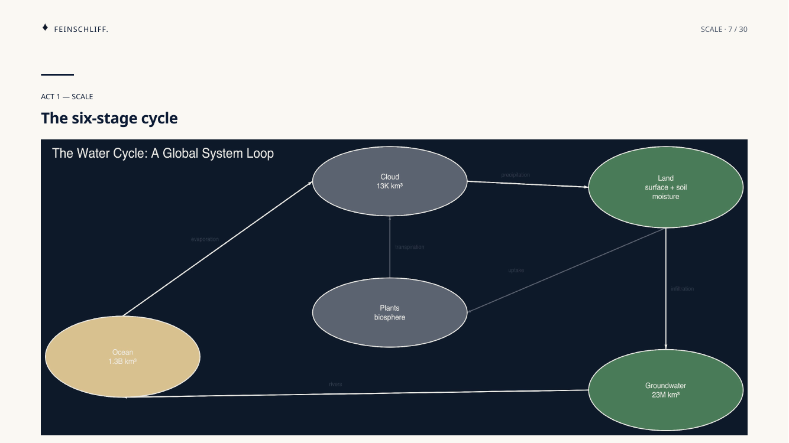
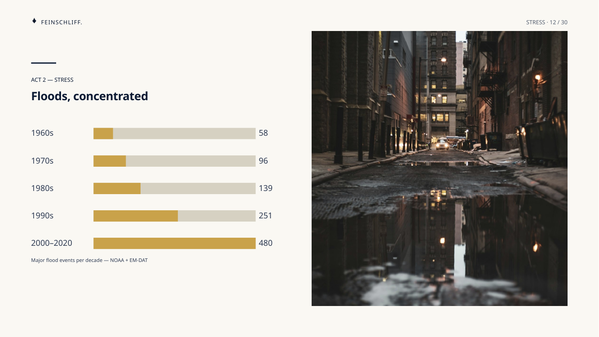
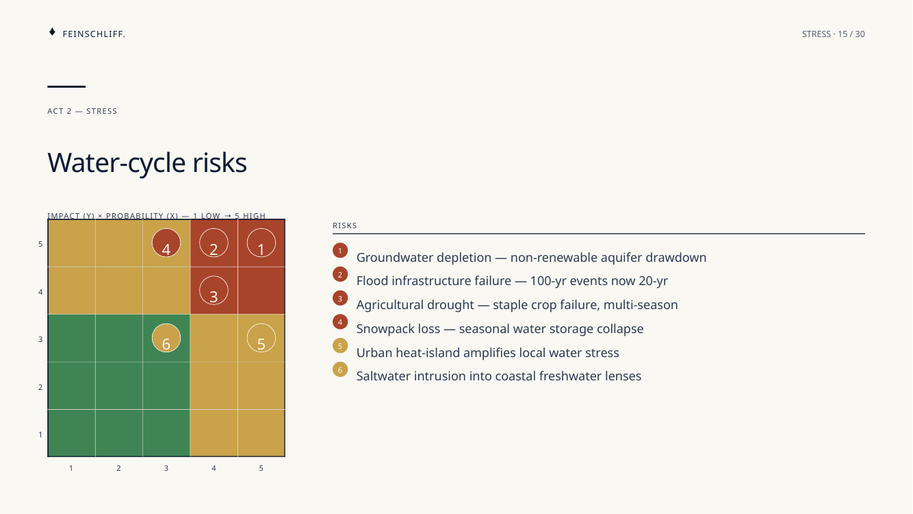
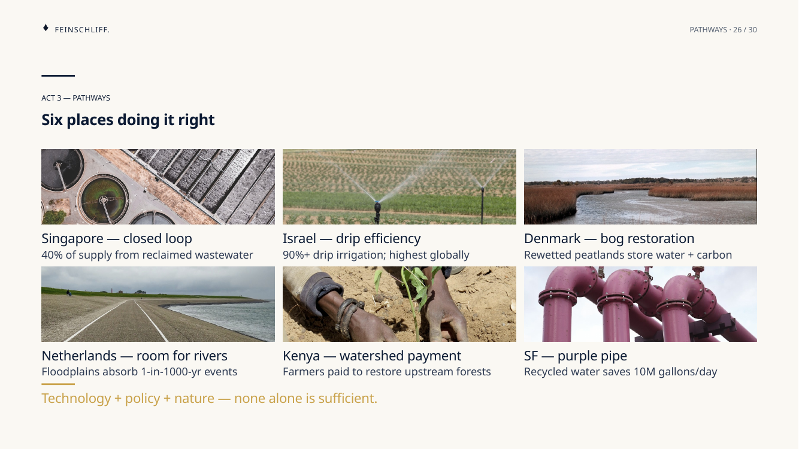
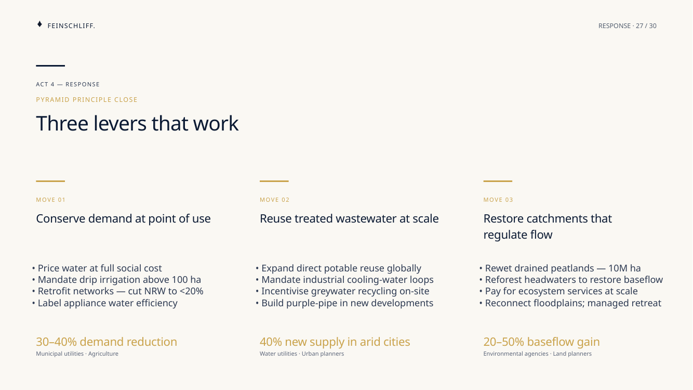
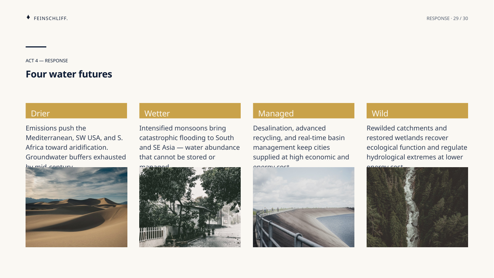
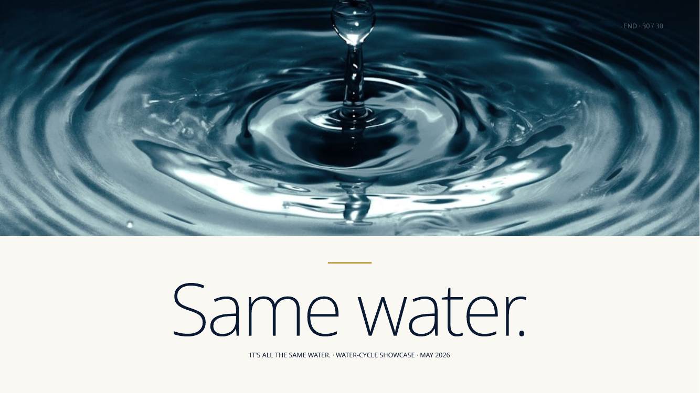

# The Hidden Engine — Water-Cycle Showcase

| Field | Value |
|---|---|
| Frame | SCQA |
| Audience | Educated-adult explainer (NYT science / Crash Course tone) |
| Brand | `nord` |
| Slides | 30 |
| Language | English |
| Takeaway | It's all the same water — and it's accelerating |
| Hook | *More energy than every power plant on Earth — combined.* |

## What this deck demonstrates

Feinschliff's full surface mix in a single narrative deck:

- **26+ distinct layouts** across 30 slides — covers, editorial, data, strategic, diagrams, text.
- **7 new image-slot layouts authored alongside this deck** — `photo-grid`, `kpi-photo`, `chart-photo`, `full-bleed-editorial`, `end-image`, `agenda-photo`, `photo-strip-four`. All ship as toolkit-shared and inherited by every brand pack.
- **18 photos** sourced from Unsplash (per-slide credits in [`ATTRIBUTION.md`](ATTRIBUTION.md)).
- **2 centerpiece diagrams** — Excalidraw six-stage cycle (slide 7) + bespoke SVG "drawn to scale" reservoir cross-section (slide 5).
- **16 cited data slides** drawing from USGS, IPCC AR6, NOAA SOTC, ECMWF, FAO AQUASTAT, UN WWAP, WRI Aqueduct, NSIDC, and WGMS. Citations live in PPTX speaker notes so the deck doubles as a self-contained reference.

## Story arc (SCQA)

| Act | Slides | Beat |
|---|---|---|
| Cover + open | 1–3 | Title · agenda (photo) · hook |
| Act 1 — Scale | 4–8 | Reservoirs, drawn to scale, the cycle as a system, Heraclitus closer |
| Act 2 — Stress | 9–18 | 350 years of measurement, intensification, regime shifts, risks, monitoring outcomes |
| Act 3 — Pathways | 19–26 | Where each drop goes — residence times, phase overlaps, urban loop, fate of a rainfall, water-use hierarchy, six exemplars worldwide |
| Act 4 — Response | 27–29 | Three Pyramid-Principle moves; three takeaways; four futures |
| Close | 30 | "Same water." |

Open the full deck (hosted on R2 to keep the repo lightweight — the
plugin install includes the renderer, not the deck binaries):

- **[`deck.pdf`](https://assets.marsmike.com/feinschliff/examples/water-cycle/deck.pdf)** — rendered PDF for review
- **[`deck.pptx`](https://assets.marsmike.com/feinschliff/examples/water-cycle/deck.pptx)** — editable PowerPoint / Keynote source

## Slide-by-slide

| # | Layout | Title |
|---|---|---|
| 1 | `full-bleed-cover` | The Hidden Engine — 505,000 km³ per year |
| 2 | `agenda-photo` | Today |
| 3 | `action-title` | More energy than every power plant on Earth — combined. |
| 4 | `kpi-grid` | Four reservoirs |
| 5 | `svg-infographic-full` | Drawn to scale |
| 6 | `chapter-ink` | Earth's Engine |
| 7 | `excalidraw-diagram-full` | The six-stage cycle |
| 8 | `quote` | "No man ever steps in the same river twice." — Heraclitus |
| 9 | `full-bleed-editorial` | Changing faster than we measured for. |
| 10 | `timeline` | Three centuries of measurement |
| 11 | `line-chart` | Precipitation extremes, 1960–2025 |
| 12 | `chart-photo` | Floods, concentrated |
| 13 | `table` | Water stress by region, 2025 |
| 14 | `2x2-matrix` | Four climate regimes |
| 15 | `risk-matrix` | Water-cycle risks |
| 16 | `text-picture` | Clausius–Clapeyron |
| 17 | `scorecard` | What we measure |
| 18 | `kpi-photo` | What measurement bought us |
| 19 | `full-bleed-editorial` | Six pathways. |
| 20 | `bar-chart` | Residence times |
| 21 | `venn` | Three phases overlap |
| 22 | `process-flow` | Urban water loop |
| 23 | `waterfall` | Fate of a rainfall |
| 24 | `funnel` | From rain to glass |
| 25 | `pyramid` | Water-use hierarchy |
| 26 | `photo-grid` | Six places doing it right |
| 27 | `recommendation` | Three levers that work |
| 28 | `key-takeaways` | Three things to remember |
| 29 | `photo-strip-four` | Four water futures |
| 30 | `end-image` | Same water. |

## Thumbnails

Per-slide PNGs live under [`thumbnails/`](thumbnails/). Sample slides:

| | | |
|---|---|---|
|  |  |  |
| Cover | Drawn to scale | Six-stage cycle |
|  |  |  |
| Floods, concentrated | Risk matrix | Six exemplars |
|  |  |  |
| Three levers | Four futures | Close |

## How it was built

```bash
uv run feinschliff deck build .debug/water-cycle/content_plan.yaml \
    -o examples/water-cycle/deck.pptx
uv run feinschliff verify examples/water-cycle/deck.pptx --json
```

Build outputs:
- `deck.pptx` — editable PowerPoint source
- `deck.pdf` — rendered PDF for review
- `thumbnails/slide-{01..30}.png` — per-slide PNGs

Inputs (gitignored under `feinschliff/.debug/water-cycle/`):
- `content_plan.yaml` — 30-slide composer input + speaker notes
- `images/` — cached Unsplash photos
- `diagrams/` — Excalidraw `.exc.dsl` + SVG `.svg.dsl` + rendered intermediates

## What this is NOT

- Not a research paper — citations live in speaker notes; on-slide numbers are rounded and qualified.
- Not a polemic — register is *explainer*, not advocacy. No "we must…" claims.
- Not the only canonical example — the per-layout taxonomy template at
  [`Feinschliff-Template.pdf`](https://assets.marsmike.com/feinschliff/examples/feinschliff/Feinschliff-Template.pdf)
  ships one slide per layout as a layout-completeness proof.
