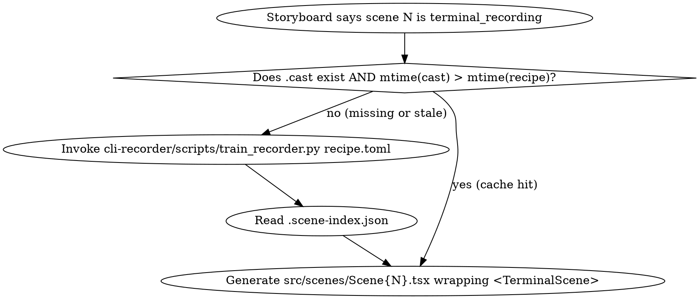

# Storyboard scene type: `terminal_recording`

Cross-cutting reference for the `terminal_recording` scene type — how it's referenced in the storyboard (Phase 1), produced during Build (Phase 3), evaluated (Phase 3.5), and verified (Phase 4). Pairs with the [`cli-recorder`](../../../../cli-recorder/README.md) plugin and the [`TerminalScene`](components-terminal-scene.md) component.

## Why a new scene type

The existing scene types (`IntroScene`, `DataScene`, `ComparisonScene`, `CodeDemoScene`, `QuoteScene`, `FlowScene`, `OutroScene`) all render *content authored in React*. None of them embed a real CLI session.

`CodeDemoScene` is the closest fit, but its "terminal output" is the `Typewriter` component — text faked frame-by-frame. For demos where the lesson IS the live tool behaviour (Claude Code thinking, `kubectl apply` rolling out, `git rebase -i` editor), faking it loses authenticity.

`terminal_recording` plugs this gap. The scene's content is a `.cast` file driven by a recipe; the storyboard merely points at the recipe, sets a chapter range, and decides how the surrounding composition (titles, captions, narration) wraps it.

## Phase 1: Storyboard

In `STORYBOARD.md`, declare a scene as `type: terminal_recording`:

```yaml
# Per-scene block in STORYBOARD.md
scene_3:
  type: terminal_recording
  recipe: ../../cli-recorder/recipes/claude-commands.recipe.toml
  span_steps: [ask, code]               # render only these recipe steps (inclusive)
  overlay:
    chapter_title: "Live Coding"
    show_step_labels: true              # render each step.label as caption when active
    zoom_on:
      - { step: code, region: prompt_input, scale: 1.4 }
  voiceover:
    sync: per_step                      # audio beats align to step boundaries
    # alternative: sync: free → continuous narration spanning the whole recording
```

| Field | Required | Notes |
|-------|----------|-------|
| `recipe` | yes | path to a recipe.toml under `cli-recorder/recipes/` |
| `span_steps` | no | `[start_step_id, end_step_id]` (inclusive). Defaults to all steps. |
| `overlay.chapter_title` | no | rendered as a TitleSlide layered over the first 1.5s |
| `overlay.show_step_labels` | no | per-step captions from the recipe's `label` |
| `overlay.zoom_on` | no | per-step zoom focal points (cell coords or named regions) |
| `voiceover.sync` | no | `per_step` (default) \| `free` |

Treat each named step as a beat. The Beat Sheet generator (Phase 1, Step 4) should:

1. Read the recipe to enumerate steps.
2. Convert each step's `label` to one beat: visual = "terminal during step X", VO = "<draft narration about that step>".
3. The user can collapse multiple recipe steps into one beat (`span_steps: [a, c]`) if pacing needs it.

Concept image generation: don't try to draw the terminal. Instead generate ONE concept image that shows the surrounding composition (frame, title, caption position) and link to a `cli-recorder/recordings/<name>.gif` preview as the "terminal target".

## Phase 2: Audio

Per-step VO is the natural rhythm:

- `voiceover.sync: per_step` — generate one MP3 per step, named `vo-<scene>-<step_id>.mp3`. Each clip's narration speaks to that step's `label` and what's happening on screen.
- `voiceover.sync: free` — generate one MP3 per scene; timing manifest aligns it to the scene's full duration.

The timing manifest emitted by Phase 2 reads the scene-index.json next to the .cast to compute frame-accurate beat boundaries:

```ts
// In src/timing.ts (codegen)
import index from '../recordings/claude-commands.scene-index.json';
const frameOf = (s: number) => Math.round(s * 30);

export const beats = {
  ask:        { from: frameOf(index.steps[2].start_s), durationInFrames: frameOf(index.steps[2].end_s - index.steps[2].start_s) },
  code:       { from: frameOf(index.steps[3].start_s), durationInFrames: frameOf(index.steps[3].end_s - index.steps[3].start_s) },
  // …
};
```

## Phase 3: Build

When a scene of type `terminal_recording` is encountered, Build does the following:



The generated scene file is a thin wrapper:

```tsx
// src/scenes/Scene3.tsx — generated from storyboard scene_3
import {Sequence, staticFile} from 'remotion';
import {TerminalScene} from '../components/TerminalScene';
import {TitleSlide} from '../components/TitleSlide';

export const Scene3 = () => (
  <Sequence durationInFrames={fps * 18}>
    {/* Chapter title overlays the first 1.5s */}
    <Sequence durationInFrames={fps * 1.5}>
      <TitleSlide title="Live Coding" />
    </Sequence>
    <TerminalScene
      castUrl={staticFile('recordings/claude-commands.cast')}
      sceneIndexUrl={staticFile('recordings/claude-commands.scene-index.json')}
      startStep="ask"
      endStep="code"
    />
  </Sequence>
);
```

Concretely, Phase 3's build step gains one new responsibility: **resolve `.cast` artifacts before scene compilation**. The existing parallel sub-agent setup (one agent per scene) already gives us isolation — the recording runner just becomes another leaf in that tree.

### Cache invalidation rules

A `.cast` file is **stale** if:
1. It does not exist, or
2. `mtime(recipe.toml) > mtime(.cast)`, or
3. The user explicitly passed `--rerecord` to the build CLI.

Rebuilds are explicit, not automatic. Recordings are slow (minutes, not seconds) and inherently non-deterministic — you don't want the build pipeline silently re-running them every time.

## Phase 3.5: Eval

Per-step keyframe sampling: instead of the default "5 frames per scene", a `terminal_recording` scene samples one frame at the *midpoint* of each step in the span:

```python
# pseudo
for step in scene.span_steps:
    midpoint = (step.start_s + step.end_s) / 2
    sample_frame = round(midpoint * fps)
    extract_still(scene_video, sample_frame, f"eval/scene{N}-step-{step.id}.png")
```

The per-scene eval sub-agent receives:
- The scene's recipe (so it knows the *intent* of each step)
- The keyframes (one per step)
- The relevant slice of the storyboard

Pass criteria:
- Each step's keyframe shows expected terminal output (label matches what's on screen).
- No render artifacts (font fallbacks, garbled escapes).
- Chapter title and captions, if specified, render correctly.

## Phase 4: Verify

Verify treats each step as a beat to confirm:

| Check | Implementation |
|-------|---------------|
| Visual match | Compare keyframe at `step.start_s` against the recipe's `step.label` via Claude vision: "does this terminal frame show *<label>*?" |
| Components | `TerminalScene` is the right component; `TitleSlide` overlay where storyboard specified |
| Animation | Cell-level diff between `step.start_s` and `step.end_s` proves *something* happened |
| Audio sync | VO MP3 boundaries align with `step.start_s/end_s` (±2 frames) |
| Theme compliance | Background, font, colour palette match design system |

The verification report (`docs/VERIFICATION_REPORT.md`) gains a per-step section for each `terminal_recording` scene.

## Worked example

The `cli-recorder` plugin's repository ships with `recipes/claude-commands.recipe.toml` and the corresponding `.cast` / `.scene-index.json`. To turn that into a polished educational video:

```yaml
# docs/STORYBOARD.md
---
title: "Claude Code: Commands & Settings Tour"
duration_seconds: 145
fps: 30
---

# Scene 1 — Intro
type: intro
title: "Claude Code in 2 minutes"
subtitle: "Commands, context, cost"
duration_s: 6

# Scene 2 — Discovery + status (paired)
type: terminal_recording
recipe: ../../cli-recorder/recipes/claude-commands.recipe.toml
span_steps: [discover, inspect]
overlay:
  chapter_title: "Discovery"
  show_step_labels: true
voiceover:
  sync: per_step

# Scene 3 — Conversational + coding (the meat)
type: terminal_recording
recipe: ../../cli-recorder/recipes/claude-commands.recipe.toml
span_steps: [ask, code]
overlay:
  chapter_title: "A real conversation"
  show_step_labels: true
  zoom_on:
    - { step: code, region: prompt_input, scale: 1.3 }
voiceover:
  sync: per_step

# Scene 4 — Context management
type: terminal_recording
recipe: ../../cli-recorder/recipes/claude-commands.recipe.toml
span_steps: [compact, continuity]
overlay:
  chapter_title: "Manage context"
voiceover:
  sync: per_step

# Scene 5 — Cost transparency
type: terminal_recording
recipe: ../../cli-recorder/recipes/claude-commands.recipe.toml
span_steps: [cost, cost]
overlay:
  chapter_title: "Know what it costs"
voiceover:
  sync: per_step

# Scene 6 — Outro
type: outro
key_message: "Ready to try it?"
cta: "code.claude.com"
duration_s: 4
```

One recipe, five `terminal_recording` scenes, four chapter titles, per-step narration, one zoom focal point. The Build phase invokes `train_recorder.py` once (cached for the rest), Eval samples 8 keyframes (the unique steps across all scenes), Verify confirms each step's frame matches its label.

## Open issues

These are tracked for the M3.5 hardening pass:

- **Recipe → beat-sheet auto-conversion in Phase 1.** Currently the user has to manually map recipe steps to scenes. A small helper (`scripts/recipe_to_beats.py`) would generate a draft beat sheet from the recipe, which the user then refines.
- **Multi-recording compositions.** Two terminals side-by-side (e.g. local vs server) needs split-screen support. The component supports it via `<SplitScreen left={<TerminalScene .../>} right={<TerminalScene .../>}/>`, but the storyboard schema doesn't have a clean way to express it yet.
- **Re-record on label-only changes.** If only `step.label` changes (cosmetic), no need to re-run the 4-minute Claude session. Solution: regenerate the scene-index.json from the existing .cast + new recipe (matching by step.text), no recording needed.
- **Concept-image generation for terminal_recording.** Phase 1 currently always generates 2 images per scene. For terminal scenes, one image (the surrounding frame/composition) plus the recording's own preview .gif is more useful. Update Step 5a accordingly.

## See also

- [`components-terminal-scene.md`](components-terminal-scene.md) — the `TerminalScene` React component
- [`cli-recorder/README.md`](../../../../cli-recorder/README.md) — the recipe-driven recorder
- [`storyboard.md`](storyboard.md) — Phase 1 storyboard authoring
- [`build.md`](build.md) — Phase 3 build pipeline
- [`docs/superpowers/specs/2026-05-10-cli-recorder-remotion-integration-design.md`](../../../../docs/superpowers/specs/2026-05-10-cli-recorder-remotion-integration-design.md) — full design rationale
